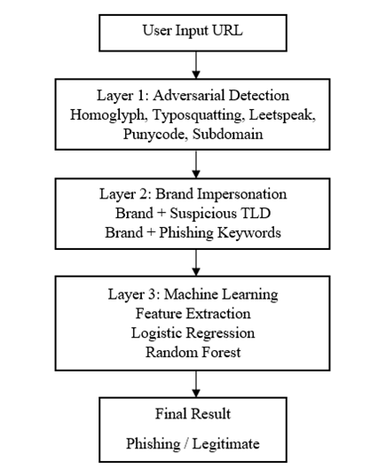
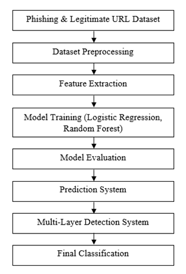
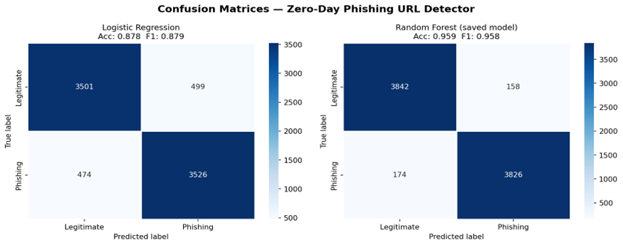
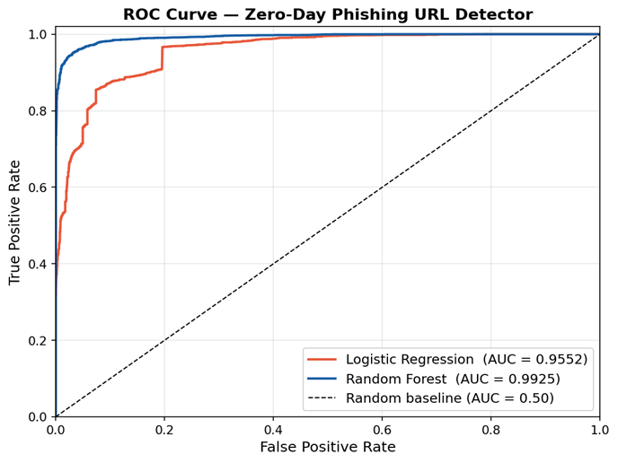
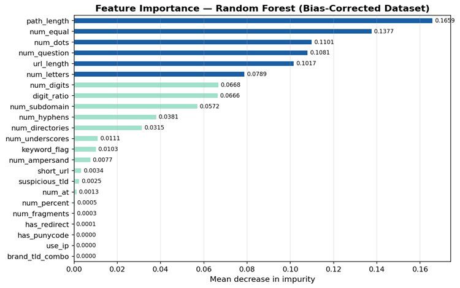

# DMML

# 🔐 Zero-Day Phishing URL Detection Using Machine Learning and Adversarial URL Analysis

## 1. Project Title

**Zero-Day Phishing URL Detection Using Machine Learning and Adversarial URL Analysis**

---

## 2. Team Details

**Team Number:** DMML#06

**Members:**

* CB.SC.P2CYS25007 – Balina Sri Vaishnavi
* CB.SC.P2CYS25006 – Atmala Sai Chandra Koushik

---

## 3. Problem Statement

Phishing attacks are one of the most common cybersecurity threats where attackers create malicious URLs that imitate legitimate websites to steal sensitive information such as login credentials, banking details, and personal data. Traditional phishing detection techniques rely on blacklist databases and signature-based detection methods, which are ineffective in detecting zero-day phishing attacks because newly generated phishing URLs are not present in blacklist databases.

This project aims to detect zero-day phishing URLs using adversarial URL analysis and machine learning techniques by analyzing URL lexical and structural features.

---

## 4. Objectives

The main objectives of this project are:

* Detect zero-day phishing URLs
* Identify adversarial phishing techniques such as typosquatting and homoglyph attacks
* Extract lexical and structural URL features
* Train machine learning models for phishing detection
* Build a multi-layer phishing detection system
* Develop a Streamlit web application for URL prediction

---

## 5. Dataset Details

**Dataset Name:** Phishing and Legitimate URL Dataset

**Dataset Sources:**

* PhishTank – https://phishtank.org
* Tranco Top 1M – https://tranco-list.eu

**Features Description:**

* URL Length
* Number of Dots
* Number of Hyphens
* Digit Count
* Subdomain Count
* Suspicious TLD Detection
* Presence of IP Address
* Punycode Detection
* Phishing Keywords
* Special Characters Count
* Directory Depth

**Dataset Size:** Approximately 40,000 URLs

---

## 6. Methodology

**Techniques Used:**

* Logistic Regression
* Random Forest

**Workflow:**

1. Collect phishing URLs from PhishTank
2. Collect legitimate URLs from Tranco
3. Merge datasets
4. Clean dataset
5. Shuffle dataset
6. Extract features from URLs
7. Train machine learning model
8. Detect adversarial URLs
9. Predict phishing URLs
10. Streamlit web application

### System Architecture



### Workflow Diagram



---

## 7. Tools & Technologies

**Programming Language:**

* Python

**Libraries Used:**

* Scikit-learn
* Pandas
* NumPy
* Matplotlib
* Seaborn
* Streamlit
* Joblib
* Python-Levenshtein

---

## 8. How to Run the Project

Clone the repository:

```bash
git clone <repository-link>
```

Navigate to source folder:

```bash
cd DMML#06/src
```

Install dependencies:

```bash
pip install -r requirements.txt
```

Run the application:

```bash
python app.py
```

---

## Results

### Confusion Matrix



### ROC Curve



### Feature Importance



---

## Project Structure

```
DMML#06/
│
├── datasets/
├── images/
├── src/
├── README.md
```

---

## Conclusion

This project developed a multi-layer zero-day phishing URL detection system using adversarial URL analysis and machine learning techniques. The layered detection approach improves detection of zero-day phishing URLs and adversarial attacks such as homoglyph attacks, typosquatting, punycode domains, IP-based URLs, and subdomain attacks. The Random Forest model achieved high accuracy and the system can be extended for real-time phishing detection applications.
